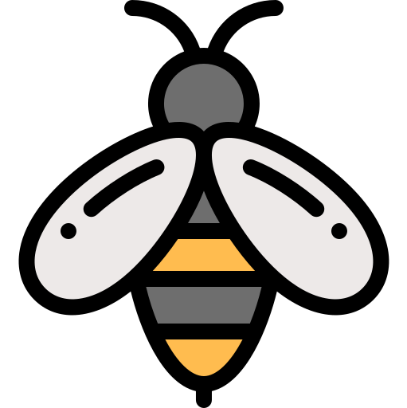

# Hive Inspection And Monitoring System (HIMS)
>This is an API for Recording And managing Bee Hive Operations


>## Prequisites
>- docker installed in your system
>- docker-compose
>- node and npm installed

## Installation Guide
```sh
npm install
```
## Run Migrations
```sh
npm run migrations
```
## Running Tests
```sh
npm run test
```
